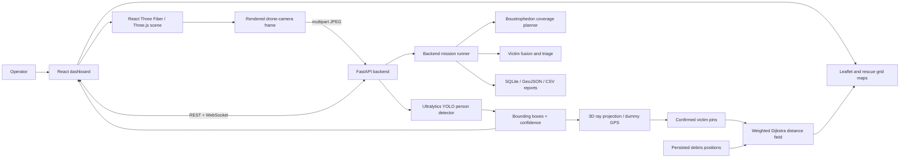

# AeroVision

## Drone-Assisted Flood Search, Victim Detection, Geolocation, and Rescue-Route Planning

**Project type:** Smart India Hackathon prototype and simulation  
**Domain:** Disaster management, flood response, UAV-assisted search and rescue  
**Primary objective:** Reduce the time required to search a flooded region, detect stranded people, estimate their locations, and generate safer routes from a rescue staging point.

---

## Table of contents

1. [Executive summary](#1-executive-summary)
2. [Problem statement](#2-problem-statement)
3. [Proposed solution](#3-proposed-solution)
4. [Scope and honesty statement](#4-scope-and-honesty-statement)
5. [System architecture](#5-system-architecture)
6. [Repository architecture](#6-repository-architecture)
7. [Frontend](#7-frontend)
8. [Three-dimensional flood simulation](#8-three-dimensional-flood-simulation)
9. [Drone model and controls](#9-drone-model-and-controls)
10. [Autonomous survey workflow](#10-autonomous-survey-workflow)
11. [AI person detection](#11-ai-person-detection)
12. [Victim geolocation and dummy GPS](#12-victim-geolocation-and-dummy-gps)
13. [Detection fusion and confirmation](#13-detection-fusion-and-confirmation)
14. [Rescue-route planning](#14-rescue-route-planning)
15. [Algorithm choices and rejected alternatives](#15-algorithm-choices-and-rejected-alternatives)
16. [Backend](#16-backend)
17. [Communication and data flow](#17-communication-and-data-flow)
18. [Specifications and configurable parameters](#18-specifications-and-configurable-parameters)
19. [Implemented features](#19-implemented-features)
20. [Performance optimizations](#20-performance-optimizations)
21. [Testing and verification](#21-testing-and-verification)
22. [Security, reliability, and failure handling](#22-security-reliability-and-failure-handling)
23. [Limitations](#23-limitations)
24. [Roadmap](#24-roadmap)
25. [SIH demonstration sequence](#25-sih-demonstration-sequence)
26. [Installation and startup](#26-installation-and-startup)
27. [API reference](#27-api-reference)
28. [Expected impact](#28-expected-impact)
29. [Conclusion](#29-conclusion)

---

## 1. Executive summary

AeroVision is an interactive flood search-and-rescue system prototype. It places a controllable and autonomous drone inside a textured three-dimensional flooded settlement. An operator can inspect the scene, draw a survey region, choose a flight altitude and speed, and launch an automatic coverage mission.

The drone follows a boustrophedon, or lawnmower, scan pattern. Its downward camera continuously sends raw rendered images to a FastAPI backend. A real YOLO person-detection model processes those images without receiving simulator coordinates, victim identifiers, or pre-declared person locations. When YOLO reports a person with at least 50% confidence during an autonomous survey, the drone pauses to confirm the observation. The detected image direction is projected into the simulated world, converted into dummy GPS coordinates, and pinned on a compact route map.

The route planner then performs one weighted Dijkstra search from the central rescue raft. It incorporates blocked safety radii and increasing risk costs around debris. Paths to all confirmed victims are extracted from the common distance field and simplified only where a direct segment remains clear and outside the risk band.

The project demonstrates a complete decision-support flow:

```text
Select region
    ↓
Plan coverage
    ↓
Launch and scan
    ↓
Run real YOLO inference
    ↓
Hover and confirm
    ↓
Estimate world position and dummy GPS
    ↓
Pin victim
    ↓
Generate safer rescue route
    ↓
Complete survey and return to launch
```

The prototype does not claim to command a real flight controller. It is a simulation and algorithm-validation environment designed to prove the software pipeline before hardware integration.

---

## 2. Problem statement

Flood response is difficult because roads, landmarks, and normal access routes may be submerged or blocked. A rescue team may have only partial visibility of:

- the region that has actually been searched;
- the location of stranded people;
- the confidence of each sighting;
- debris that blocks or increases the risk of a rescue route;
- the shortest safe route from a staging location;
- the remaining drone endurance and survey progress.

Manual search from boats is slow and exposes rescuers to danger. Ordinary aerial video helps, but a video-only workflow still requires an operator to watch every frame, remember locations, avoid duplicate reports, and manually communicate directions.

AeroVision addresses this by joining four capabilities:

1. systematic aerial coverage rather than arbitrary manual flight;
2. automated person detection from the camera image;
3. location estimation and repeated-detection handling;
4. obstacle-aware rescue-route generation.

---

## 3. Proposed solution

The proposed operational concept is:

1. A rescue team places the drone on a known launch raft or staging platform.
2. The operator opens a top view of the affected region.
3. The operator draws the required search rectangle.
4. The operator sets altitude above the launch platform and flight speed.
5. AeroVision derives the camera footprint and scan spacing.
6. The system generates alternating rows that cover the region with overlap.
7. The drone takes off and flies the route automatically.
8. The live first-person camera image is sent to YOLO.
9. If YOLO detects a person above the mission threshold, the drone hovers briefly.
10. The detection is projected into world coordinates and dummy latitude/longitude.
11. The victim is pinned on the route map.
12. A safer ground/water rescue route is computed from the raft.
13. The drone continues scanning the remaining region.
14. After the last scan point, the drone returns to and lands at launch.

The interface also supports manual drone movement, free camera inspection, victim placement, and obstacle placement so different disaster scenarios can be staged and tested.

---

## 4. Scope and honesty statement

Clear separation between implemented reality and simulation is important for a credible SIH demonstration.

### 4.1 Real software components

- YOLO inference runs on the actual camera-frame pixels.
- Only the COCO `person` class is requested from YOLO.
- Detection boxes and confidence values come from YOLO output.
- The detection endpoint receives no simulator coordinates, person model IDs, or ground-truth victim locations.
- Coverage waypoints are calculated from the selected area, altitude, field of view, and overlap.
- Drone motion follows calculated waypoints rather than a prerecorded animation.
- Rescue paths are computed at runtime from current browser-persisted obstacle and victim positions.
- The weighted Dijkstra distance field, minimum heap, obstacle inflation, corner-cut prevention, and path extraction are implemented in project code.
- The backend camera-projection, local ENU conversion, WGS84 conversion, fusion, triage, A* routing, reporting, and metrics are implemented algorithms.
- Backend geometry and end-to-end pipeline tests execute actual project code.

### 4.2 Simulated components

- The flood settlement, people, debris, trees, drone, and raft are 3D assets.
- Drone physics are kinematic; aerodynamic forces and a real autopilot are not simulated.
- GPS values are dummy coordinates anchored around the configured demonstration location.
- The drone-camera frame is rendered by Three.js rather than captured by physical hardware.
- The environment is treated as static during a survey.
- The frontend route map currently models the circular boundary and placed debris/tree obstacles; it does not yet rasterize every building wall from the flood GLTF.
- A successful ray hit on a rendered person is used after YOLO detection to obtain a stable simulated world position. YOLO itself is not given that information.

### 4.3 Hardware integration status

The backend exposes `POST /api/telemetry/ingest` as a future bridge for live GPS messages from hardware such as an ESP32 and NEO-6M. This prototype does not claim autonomous command of an unsupported physical flight controller.

---

## 5. System architecture



### 5.1 Major architectural layers

| Layer | Responsibility |
|---|---|
| Presentation | Dashboard, controls, camera feed, 3D scene, route map and telemetry |
| Simulation | Drone pose, propellers, camera pose, survey mission and editable scene entities |
| AI | Person-only YOLO inference and confidence reporting |
| Geometry | Camera footprint, ray projection, ENU and WGS84 conversion |
| Planning | Coverage planning and obstacle-aware rescue routing |
| Mission services | REST control, WebSocket streaming, detection, fusion, metrics and export |
| Persistence | Browser local storage for scene placement and SQLite for mission reports |

---

## 6. Repository architecture

```text
AeroVision/
├── backend/
│   ├── app/
│   │   ├── main.py           FastAPI entry point and API endpoints
│   │   ├── mission.py        Backend mission orchestration loop
│   │   ├── detector.py       YOLO person-only inference adapter
│   │   ├── planner.py        Boustrophedon coverage planner
│   │   ├── astar.py          Single-target grid routing
│   │   ├── camera.py         Synthetic camera and scene loading
│   │   ├── geo.py            ENU/WGS84 and camera projection geometry
│   │   ├── drone.py          Backend drone kinematic simulation
│   │   ├── fusion.py         Repeated-detection clustering
│   │   ├── triage.py         Transparent rescue-priority heuristic
│   │   ├── store.py          SQLite, GeoJSON and CSV reporting
│   │   └── config.py         AV_-prefixed configuration
│   ├── assets/
│   │   ├── scene.json        Runtime demonstration-scene metadata
│   │   └── ortho.png         Runtime orthophoto
│   ├── tools/                Scene building, calibration and tests
│   ├── requirements.txt
│   └── README.md
├── frontend/
│   ├── public/models/        Licensed runtime GLTF assets and textures
│   ├── src/
│   │   ├── api/              REST and WebSocket clients
│   │   ├── components/       Dashboard, map, telemetry and 3D scene
│   │   ├── hooks/            Shared streamed mission state
│   │   ├── lib/
│   │   │   ├── rescuePlanner.js
│   │   │   └── surveyMission.js
│   │   ├── styles/
│   │   ├── App.jsx
│   │   └── main.jsx
│   ├── package.json
│   └── vite.config.js
├── docs/
│   └── SIH_PROJECT_DOCUMENTATION.md
├── scripts/
│   ├── setup.ps1
│   ├── start-backend.ps1
│   └── start-frontend.ps1
├── .editorconfig
├── .gitattributes
├── .gitignore
└── README.md
```

---

## 7. Frontend

### 7.1 Technology stack

| Technology | Project use |
|---|---|
| React 18 | Component-based dashboard and application state |
| Three.js | 3D rendering, materials, ray casting, cameras and model transforms |
| React Three Fiber | Declarative React integration for Three.js |
| Drei | GLTF loading, model preloading, environment lighting and map controls |
| Leaflet | Geographic orthophoto view and mission overlays |
| Vite | Development server, optimized production bundling and backend proxy |
| CSS design tokens | Consistent mission-console typography, colors and status semantics |

### 7.2 Why React

The interface contains several independently changing regions: telemetry, mission status, WebSocket connection state, camera detections, selected objects, survey controls, and route-map updates. React provides predictable component composition and lifecycle management for those regions.

React was preferred over manually manipulating the DOM because manual synchronization between WebSocket state, controls, and multiple views would become error-prone. A full enterprise state library was not added because the current application can be handled with hooks, refs, and module-level high-frequency simulation state.

### 7.3 Why React Three Fiber

React Three Fiber lets the 3D scene coexist naturally with React state and components. Models, lights, controls, selectors, and cameras are expressed declaratively while the frame loop remains available for high-frequency drone and object updates.

Using raw Three.js alone would be possible, but it would require manual creation, mounting, cleanup, and synchronization of every object. A game engine such as Unity would provide stronger physics tooling, but it would increase deployment size, browser integration complexity, and communication overhead with the web dashboard.

### 7.4 Dashboard composition

The dashboard contains:

- a 3D Scene / Map view toggle;
- connection status and compact survey-area, altitude, speed and launch controls;
- the main interactive 3D flood viewport;
- aircraft telemetry below the main viewport;
- a live drone-camera panel;
- real YOLO bounding boxes over the camera image;
- a rescue-route grid map;
- a detected-victim list for backend missions;
- top-view survey drawing controls;
- altitude and speed inputs;
- manual camera presets and camera navigation instructions;
- context-sensitive keyboard-control instructions.

The Aircraft panel below the main viewport continuously reports selected search
zone area, coverage percentage, confirmed people, and drone altitude. The same
YOLO detection, simulated geolocation, victim pinning, and route generation
remain active during manual drone flight; a drawn search zone additionally
allows manual movement to contribute to coverage progress.

### 7.5 High-frequency state strategy

Drone, person, and obstacle positions are updated every render frame. Sending each update through React state would cause unnecessary reconciliation and dashboard repainting. AeroVision therefore keeps live poses in mutable objects and maps while React state is reserved for coarse UI events such as selection, mission start, and saved placement.

WebSocket image messages are also coalesced through `requestAnimationFrame`. If multiple frames arrive before the browser can paint, only the newest frame is committed to React. This prevents an ever-growing render queue.

---

## 8. Three-dimensional flood simulation

### 8.1 Environment

The main GLTF represents a flooded settlement with a circular usable region. The project restores missing material mappings using explicit object-name-to-texture rules. It also replaces the incorrectly black flood mesh with a muddy physical water material.

The flood material uses:

- muddy brown-green color;
- physical reflectivity;
- clear-coat response;
- moderate roughness;
- double-sided rendering;
- environment-map lighting.

An oversized decorative sky dome included in the source export is hidden because it can block the camera when orbiting. The usable environment stays static and horizontal while the viewer camera pans, rotates, and zooms.

### 8.2 Lighting and visibility

The scene combines:

- ambient lighting for readable shadowed geometry;
- directional warm light;
- hemisphere lighting;
- an environment preset for reflections;
- exponential fog for depth and atmosphere.

Expensive scene-wide real-time shadows are disabled. The source environment contains many meshes, and re-rendering shadow maps would consume GPU time without significantly improving the operational demo.

### 8.3 Camera navigation

The main viewer supports:

- left-drag panning;
- right-drag rotation;
- wheel zoom toward the cursor;
- free, top, front, and reset presets;
- damping for controlled motion;
- distance and polar-angle limits.

The model itself does not rotate when the user inspects the environment. The camera moves around a fixed world, which preserves all simulation coordinates.

### 8.4 People

Four independent people models are normalized to a common visible height despite using different authoring units. Skeleton-aware cloning is used for skinned meshes so each person can move independently.

Each person can be selected and adjusted with:

- `W/S` for local forward/backward movement;
- `A/D` for local strafing;
- `Up/Down` for height;
- `Left/Right` for rotation;
- `Enter` to save.

Negative height is intentionally allowed so partial submersion and drowning scenarios can be represented. Saved poses use browser local storage and survive page reloads.

### 8.5 Obstacles

The simulation includes three obstacle families:

- rock debris type 1;
- rock debris type 2;
- trees.

Ten copies of each family are rendered, producing 30 editable obstacles. All copies share cached GLTF geometry and textures. Their family sizes are centrally configured so changing one value changes every copy of that model type.

Obstacle controls match person controls and also persist to browser local storage. Initial copies are distributed across rings, after which the operator may create any desired scenario.

### 8.6 Runtime assets

All runtime models are stored once under `frontend/public/models`. Original standalone duplicates were removed. Each downloaded model retains its `license.txt`, and texture dimensions were reduced where appropriate to improve browser loading and Git repository size.

---

## 9. Drone model and controls

### 9.1 Drone asset

The supplied animated drone model is used instead of a procedurally constructed placeholder. Its showroom plate is hidden because it is not part of the aircraft. The drone starts on a custom raft containing a deck, flotation tubes, and a landing ring.

### 9.2 Propeller animation

The model's authored animation clip contains pauses and therefore cannot provide reliable continuous rotor motion. AeroVision identifies the four propeller assemblies and rotates them directly every frame.

Behavior:

- rotors start after launch;
- they continue spinning while airborne;
- counter-rotating pairs rotate in opposite directions;
- `P` toggles propeller motion during manual control;
- rotors stop after autonomous landing.

### 9.3 Manual controls

When no person or obstacle is selected:

- `W/S`: forward/backward;
- `A/D`: left/right strafe;
- `Up/Down`: altitude;
- `Left/Right`: yaw;
- `P`: propeller pause/resume.

The camera side of the 3D model is treated as the physical front. Movement and FPV direction use the same local negative-Z convention, avoiding reversed controls.

### 9.4 Flight boundaries

Manual flight is constrained to the circular flood region. Altitude is clamped between the parked height and an upper simulation limit. The drone uses small pitch and roll cues during movement to improve visual readability; these are presentation cues, not an aerodynamic model.

---

## 10. Autonomous survey workflow

### 10.1 Drawing a survey area

The operator presses **Draw Survey Area**. AeroVision switches to top view and temporarily disables map controls. Pointer rays intersect an invisible horizontal plane over the environment. Dragging produces world-space minimum and maximum X/Z coordinates and displays a wireframe survey box.

Coordinates are clamped to the usable map bounds. Generated scan points outside the circular region are discarded so the drone cannot wait forever for an unreachable waypoint.

### 10.2 User-configurable mission parameters

The operator sets:

- altitude: 3 to 60 metres above the launch-platform drone height;
- speed: 0.5 to 12 metres per second.

The launch-platform reference is explicit: the parked drone height is 2.2 world units, and survey altitude is added to that value.

### 10.3 Camera footprint

The frontend survey uses a 72-degree field of view. For altitude `h`, the approximate square ground footprint width is:

```text
footprint = 2 × h × tan(FOV / 2)
```

A minimum footprint of 4 metres prevents excessive waypoint density at very low altitude.

### 10.4 Overlap and spacing

Survey spacing is 70% of the footprint:

```text
step = footprint × 0.70
```

This corresponds to approximately 30% overlap. Overlap reduces gaps and gives the detector multiple opportunities to see a person near a frame boundary.

### 10.5 Boustrophedon path

Points are generated row by row. Even rows traverse left-to-right and odd rows traverse right-to-left. Alternating direction removes unnecessary return travel at the end of each row.

The mission waypoint sequence is:

1. vertical climb over launch;
2. first scan point;
3. alternating scan rows;
4. return above launch;
5. descend to the launch height.

### 10.6 Autonomous execution

On every animation frame, the drone moves toward the active waypoint using the selected speed. Yaw is aligned with movement direction. A waypoint is considered reached within a small positional tolerance, then the mission advances to the next waypoint.

Mission states are:

| State | Meaning |
|---|---|
| `idle` | No survey has started |
| `scanning` | Travelling through coverage waypoints |
| `confirming` | Hovering after a new detection |
| `rtl` | Returning to launch |
| `complete` | Landed and mission finished |

### 10.7 Detection hover

When a new detection reaches at least 50% confidence:

- the detection is checked against existing pins;
- the drone enters `confirming`;
- movement pauses for 2.2 seconds;
- propellers remain active;
- the victim is geolocated and added to the route map;
- scanning resumes automatically.

The seven-metre duplicate radius prevents the drone from repeatedly hovering over the same victim every 750 milliseconds.

### 10.8 Return to launch

The final two waypoints return the aircraft to the raft and lower it to the parked height. The mission becomes complete and the propellers decelerate to a stop.

---

## 11. AI person detection

### 11.1 Model

The backend uses Ultralytics YOLO with the default lightweight `yolov8n.pt` weights. Inference is restricted to COCO class 0, `person`.

YOLO was selected because it provides:

- single-stage real-time object detection;
- bounding boxes, classes, and confidence values in one inference pass;
- strong ecosystem and pretrained COCO person recognition;
- CPU support for portable demonstrations;
- GPU support for deployment performance;
- straightforward Python integration.

### 11.2 Input isolation

The endpoint `POST /api/detection/frame` accepts only encoded image bytes. It does not receive:

- drone world coordinates;
- person object identifiers;
- known person positions;
- obstacle locations;
- ground-truth labels;
- simulator model metadata.

This design prevents fake detection based on known scene placement. Bounding boxes shown on the FPV feed are produced from the returned YOLO result.

### 11.3 Inference pipeline

```text
Three.js FPV canvas
    ↓ canvas.toBlob(JPEG, quality 0.88)
multipart/form-data upload
    ↓
FastAPI decodes JPEG with OpenCV
    ↓
Ultralytics YOLO person-only prediction
    ↓
xyxy bounding boxes + confidence + latency
    ↓
JSON response
    ↓
Bounding-box overlay and survey detection handling
```

The frontend submits a frame every 750 milliseconds when the previous request has completed. A busy flag prevents overlapping inference requests and unbounded queues.

### 11.4 Confidence thresholds

Two thresholds have different purposes:

- backend detector default: 0.35, configurable using `AV_CONF`;
- autonomous-survey confirmation: 0.50.

The lower backend threshold preserves candidate observations for fusion. The higher survey threshold controls the immediate hover-and-pin demonstration.

### 11.5 Concurrency

YOLO inference is moved to a worker thread through `asyncio.to_thread`. An asynchronous lock serializes access to the model. This keeps the FastAPI event loop available for telemetry and WebSocket traffic without allowing concurrent inference to overload the model.

### 11.6 Runtime fallback

If Ultralytics, PyTorch, weights, or the requested device cannot load, the backend falls back to a stub detector. The rest of the system can still run and tests can still validate geometry, but no people will be detected. The backend clearly reports the active detector device.

### 11.7 Why not texture-only classification

A texture classifier cannot reliably distinguish a person from a person-like patch because it lacks object localization and shape context. YOLO processes learned spatial features across the image and returns an object extent. It can detect a rendered 3D person if the rendering resembles the visual distribution learned from person images, but success depends on view angle, scale, lighting, occlusion, and texture realism.

### 11.8 Why not train on known scene locations

Using known positions would create scripted detections rather than evaluate visual recognition. AeroVision keeps detection blind to scene coordinates. Scene knowledge is used only after YOLO has reported a box, for simulated localization and evaluation.

---

## 12. Victim geolocation and dummy GPS

The repository includes two complementary geolocation implementations.

### 12.1 Live 3D FPV localization

For the interactive 3D survey:

1. select the strongest YOLO box above 50%;
2. take the box centre in image coordinates;
3. convert it to normalized device coordinates;
4. unproject it through the current Three.js camera;
5. construct a world-space ray;
6. raycast through the rendered scene;
7. if the ray intersects a rendered person hierarchy, use that victim's live world pose;
8. otherwise use the nearest scene intersection;
9. convert the resulting world X/Z coordinates to dummy GPS.

The approximate dummy-GPS conversion is anchored at:

```text
latitude  = 21.2514
longitude = 81.6296
```

Longitude scaling includes the cosine of latitude. This is appropriate for the small local demonstration area.

### 12.2 Backend photogrammetric localization

The backend synthetic-ortho pipeline uses a more formal camera model:

- local East-North-Up coordinates;
- WGS84 ellipsoid scale factors;
- camera intrinsics derived from image size and horizontal FOV;
- camera pose containing east, north, altitude, heading, and tilt;
- world-to-camera rotation;
- ground homography;
- image-ray intersection with the ground plane.

For an oblique camera, the detector supplies the bottom-centre of the box as the ground-contact anchor. That pixel is back-projected to the flat ground plane and converted from ENU to latitude/longitude.

### 12.3 Why use a local tangent plane

The mission covers only a few hundred metres. Local ENU coordinates make distance, coverage, and grid calculations simple and numerically stable. A full global map projection would add complexity without meaningful improvement at this scale.

### 12.4 Flat-ground assumption

Backend homography is exact only for points on the assumed ground plane. Real deployment over rooftops, sloped terrain, or people above the ground requires elevation data, depth estimation, stereo vision, lidar, or ray intersection with a 3D terrain model.

---

## 13. Detection fusion and confirmation

Overlapping camera footprints naturally produce repeated observations of the same person. Treating every box as a new victim would overcount casualties.

The backend `VictimFuser` performs online spatial clustering:

1. compare a new georeferenced detection with existing tracks;
2. find the nearest track inside a configurable merge radius;
3. create a new victim if no track is close enough;
4. otherwise update the existing location with a confidence-weighted mean;
5. increase sighting count;
6. preserve best and mean confidence;
7. mark a track confirmed after a configurable number of sightings.

Default backend values:

- merge radius: 6 metres;
- confirmation count: 3 sightings.

This provides a simple, explainable method for suppressing one-frame false positives and merging repeated views.

### 13.1 Triage ranking

The backend includes a transparent heuristic score:

| Signal | Weight |
|---|---:|
| Best detection confidence | 0.30 |
| Persistence across sightings | 0.20 |
| Floodwater hazard | 0.30 |
| Isolation from base | 0.20 |

The result is categorized as moderate, high, or critical. This is a rescue-priority aid, not a medical diagnosis. The score is deliberately explainable rather than generated by an opaque model.

---

## 14. Rescue-route planning

### 14.1 Problem formulation

The current interactive problem has one central staging raft and multiple confirmed victims. The route map must respond to the operator's persisted debris arrangement rather than display predetermined lines.

The world is converted to a two-dimensional grid:

- circular radius: 132 metres;
- centre Z: -85 world units;
- grid resolution: 4 metres;
- approximately 67 × 67 cells;
- eight-connected neighbour movement.

### 14.2 Obstacle representation

Each editable obstacle family has a minimum blocked safety radius:

| Obstacle | Blocked radius |
|---|---:|
| Rock debris 1 | 5.5 m |
| Rock debris 2 | 6.5 m |
| Tree | 4.5 m |

Cells outside the circular map are also blocked.

### 14.3 Weighted risk band

Binary collision checks alone encourage paths that skim the edge of debris. AeroVision adds a ten-metre risk band outside each blocked radius. Movement cost increases as a cell approaches an obstacle.

Conceptually:

```text
edge cost = geometric step length × weighted local risk
```

This allows the planner to prefer a slightly longer route with more clearance.

### 14.4 Weighted Dijkstra distance field

One Dijkstra search starts at the raft and expands through the complete reachable grid. It records:

- shortest known accumulated cost per cell;
- predecessor cell for path reconstruction;
- blocked and risk-weighted regions.

The same completed search provides a route to every confirmed victim. This is more appropriate than separately running A* once for every victim when all goals share one start and are required at the same time.

### 14.5 Diagonal movement safety

Eight-connected movement reduces staircase artifacts. However, diagonal moves are rejected if either adjacent orthogonal cell is blocked. This prevents the mathematical path from cutting through the corner of two obstacles.

### 14.6 Any-angle extraction

The raw predecessor path follows grid cells. AeroVision then looks ahead from each retained point and keeps the farthest later point that has clear line of sight.

A long simplification shortcut is accepted only if sampled points are:

- not blocked;
- not outside the circular region;
- not inside the obstacle risk band.

If no zero-risk shortcut exists, the adjacent weighted-grid path is retained,
allowing a necessary risk-band traversal without ever entering a blocked cell.

This produces cleaner paths without discarding the safety constraints that influenced Dijkstra.

### 14.7 Unreachable victims

If the target cell has infinite distance after Dijkstra completes, the victim is marked unreachable and no false route is drawn.

### 14.8 Computational complexity

For `V` grid cells and `E` neighbour edges, heap-based Dijkstra is approximately:

```text
O((V + E) log V)
```

The current grid contains only a few thousand cells, so recalculating routes at interactive frequency is practical in the browser.

### 14.9 Backend A* route planner

The backend also retains a legitimate single-victim A* planner for geographic missions. It:

- rasterizes water and debris polygons;
- inflates obstacles for clearance;
- uses an octile heuristic for eight-connected movement;
- prevents corner cutting;
- snaps blocked start/goal locations to nearby free cells;
- simplifies collinear points;
- returns GPS path, distance, and node count.

This is not a contradiction. Weighted Dijkstra is used for the current one-start/many-target interactive route map, while A* remains useful for a single coordinator-selected target.

---

## 15. Algorithm choices and rejected alternatives

### 15.1 Coverage: boustrophedon rather than A*

**Selected:** Boustrophedon/lawnmower coverage.

Coverage requires visiting the whole selected area, not merely reaching one goal. Alternating scan rows provide predictable coverage, simple overlap control, and a low number of turns.

**Why not A*:** A* solves point-to-point shortest paths and has no built-in concept of camera footprint coverage.

**Why not random walk:** It provides no coverage guarantee, repeats areas, and wastes battery.

**Why not spiral-only coverage:** A spiral is effective for some convex regions but handles arbitrary rectangular or clipped regions less predictably and can accumulate spacing error around obstacles.

### 15.2 Rescue routes: weighted Dijkstra for all victims

**Selected:** One weighted Dijkstra distance field followed by safe any-angle simplification.

Advantages:

- one search supports all victims;
- deterministic;
- optimal with respect to the configured positive grid costs before simplification;
- naturally supports risk weights;
- returns explicit unreachable state;
- easy to explain and test.

The claim that it is always exactly `N` times faster than running A* for `N` victims would be incorrect. Actual speed depends on goal positions and A* heuristic effectiveness. The defensible claim is that one shared search avoids repeated expansion and provides distances to all reachable targets simultaneously.

### 15.3 A* for single interactive routes

**Retained for:** one selected destination when heuristic guidance is valuable.

A* usually expands fewer cells than Dijkstra for a known single goal. It remains in the backend for point-to-point geographic route requests.

### 15.4 Why not plain binary shortest path

Binary occupancy treats a route 10 centimetres from debris as equivalent to one with ten metres of clearance. Weighted proximity costs encode operational preference for safer clearance.

### 15.5 Why not RRT or RRT*

Sampling-based planners are valuable for continuous high-dimensional configuration spaces, non-holonomic constraints, and robot arms. This rescue problem is a known two-dimensional static grid. RRT is non-deterministic and does not guarantee the shortest path. RRT* becomes asymptotically optimal but needs many samples and offers no advantage for this small raster map.

### 15.6 Why not PRM

Probabilistic Roadmaps are useful when many queries occur in the same continuous configuration space and an expensive roadmap can be reused. The current grid already provides a compact reusable graph with deterministic connectivity and costs.

### 15.7 Why not potential fields

Potential fields are computationally simple but can become trapped in local minima, oscillate near obstacles, and fail in narrow passages. A disaster-response route must explicitly report unreachable conditions rather than silently stall.

### 15.8 Why not D* Lite now

D* Lite is excellent for incremental replanning when obstacle knowledge changes while a robot moves. The current simulation treats scene obstacles as static during a mission and recomputes a small grid quickly. D* Lite is a logical future upgrade for live debris changes, but it would add complexity without current benefit.

### 15.9 Why not a neural-network path planner

The search space is small, structured, and safety-sensitive. Classical graph search is deterministic, inspectable, and does not need training data. A learned planner could be difficult to verify and may fail unpredictably outside its training distribution.

### 15.10 Why YOLO rather than a two-stage detector

Two-stage detectors can provide high accuracy but typically require more inference time. YOLO provides a strong speed/accuracy balance for a live or near-live dashboard and is easier to deploy on modest hardware.

### 15.11 Why not image segmentation as the first AI task

Instance or semantic segmentation could provide a more precise person outline, but the project primarily needs presence, approximate location, confidence, and a bounding box. Detection is cheaper and sufficient for geolocation. Segmentation remains useful for future flood-depth or traversability mapping.

---

## 16. Backend

### 16.1 Technology stack

| Technology | Purpose |
|---|---|
| Python | Geometry, AI and mission services |
| FastAPI | REST API and WebSocket server |
| Uvicorn | ASGI development/runtime server |
| Ultralytics | YOLO model loading and prediction |
| PyTorch | Neural-network inference runtime |
| OpenCV | JPEG decoding/encoding and synthetic camera rendering |
| NumPy | Matrix, image and grid calculations |
| Shapely | Polygon clipping, buffering, coverage unions and point tests |
| Pydantic | Request validation |
| SQLite | Mission-report persistence |

### 16.2 Startup sequence

When FastAPI starts:

1. load `backend/assets/scene.json`;
2. load the referenced orthophoto;
3. construct the detector for the configured device;
4. warm up YOLO;
5. create the mission runner;
6. print scene and detector information.

### 16.3 Backend mission runner

The backend includes a complete geographic synthetic-camera mission loop independent of the interactive Three.js survey:

1. validate a latitude/longitude polygon;
2. compute a coverage plan;
3. arm the drone simulator;
4. update pose at configured simulation frequency;
5. trigger the camera based on distance travelled;
6. render the current camera view from the orthophoto;
7. run YOLO;
8. back-project boxes to GPS;
9. fuse sightings;
10. compute coverage and accuracy metrics;
11. stream telemetry, frames, detections and metrics;
12. return to launch when the waypoint list is complete;
13. produce a mission report.

### 16.4 Distance-based camera triggering

Capturing solely on a time interval makes the number of images per ground point depend on speed. AeroVision derives the along-track footprint length and triggers after travelling:

```text
trigger distance = along-track footprint × (1 - forward overlap)
```

A maximum detection frequency still protects compute resources. This preserves image overlap even if drone speed or simulation time scale changes.

### 16.5 Coverage measurement

Coverage is not estimated from waypoint completion. The backend unions actual camera footprint polygons, intersects the union with the requested polygon, and divides by requested area. An aborted mission therefore reports the region actually imaged.

### 16.6 Mission export

Reports can be persisted to SQLite and exported as:

- JSON report;
- GeoJSON;
- CSV.

This converts a visual demonstration into a transferable operational artifact.

---

## 17. Communication and data flow

### 17.1 Frontend to backend

- REST retrieves scene metadata and orthophoto.
- REST starts or stops backend missions.
- Multipart REST uploads live Three.js camera frames for detection.
- REST requests a single-victim A* route.
- REST saves and exports mission reports.

### 17.2 Backend to frontend

WebSocket messages include:

| Type | Content |
|---|---|
| `hello` | Runtime settings and current mission state |
| `plan` | Polygon, waypoints, swath, spacing, legs and estimated duration |
| `telemetry` | Drone pose, battery, waypoint progress and camera footprint |
| `frame` | JPEG, dimensions, detections and latency |
| `victims` | Fused and triaged victim tracks |
| `metrics` | Coverage, detector statistics and accuracy |
| `mission_complete` | Final report |
| `mission_stopped` | Abort acknowledgement |
| `error` | Operator-visible error message |

### 17.3 Development proxy

Vite proxies `/api` and `/ws` to `127.0.0.1:8000`. The browser uses one origin during development, simplifying CORS and deployment paths.

---

## 18. Specifications and configurable parameters

### 18.1 Frontend simulation constants

| Parameter | Current value |
|---|---:|
| Circular environment radius | 132 world metres |
| Environment centre Z | -85 |
| Drone parked height | 2.2 |
| Drone FPV FOV | 72° |
| Detection capture interval | 750 ms |
| Detection JPEG quality | 0.88 |
| Survey altitude input | 3–60 m |
| Survey speed input | 0.5–12 m/s |
| Survey overlap | approximately 30% |
| Confirmation threshold | 50% |
| Hover confirmation duration | 2.2 s |
| Frontend route-grid resolution | 4 m |
| Duplicate pin radius | 7 m |
| People models | 4 |
| Obstacle families | 3 |
| Copies per obstacle family | 10 |
| Total editable obstacles | 30 |

### 18.2 Backend default configuration

All fields are overridable with `AV_`-prefixed environment variables.

| Setting | Default | Environment variable |
|---|---:|---|
| Scene metadata | `assets/scene.json` | `AV_SCENE` |
| Camera width | 960 px | `AV_IMG_W` |
| Camera height | 540 px | `AV_IMG_H` |
| Horizontal FOV | 62.2° | `AV_HFOV` |
| Flight altitude | 40 m | `AV_ALT` |
| Camera tilt | 25° | `AV_TILT` |
| Flight speed | 6 m/s | `AV_SPEED` |
| Endurance | 780 s | `AV_ENDURANCE` |
| Side overlap | 40% | `AV_SIDELAP` |
| YOLO weights | `yolov8n.pt` | `AV_MODEL` |
| Device | CPU | `AV_DEVICE` |
| YOLO threshold | 0.35 | `AV_CONF` |
| Inference image size | 960 | `AV_IMGSZ` |
| Detection ceiling | 8 Hz | `AV_DETECT_HZ` |
| Forward overlap | 80% | `AV_FWD_OVERLAP` |
| Fusion merge radius | 6 m | `AV_MERGE_R` |
| Fusion confirmation | 3 sightings | `AV_CONFIRM_AT` |
| Simulation rate | 10 Hz | `AV_SIM_HZ` |
| Demo time scale | 4× | `AV_TIME_SCALE` |
| Stream width | 720 px | `AV_STREAM_W` |
| Route-grid resolution | 4 m | `AV_GRID_RES` |

### 18.3 Backend demonstration scene

| Attribute | Value |
|---|---:|
| Orthophoto dimensions | 4000 × 2666 px |
| Ground sample distance | 0.03 m/px |
| Physical dimensions | approximately 120 × 80 m |
| Configured truth people | 14 |
| GPS anchor | 21.2514, 81.6296 |

### 18.4 Software requirements

- Windows PowerShell 5.1+
- Python 3.10+
- Node.js 20+
- npm 10+
- modern browser with WebGL support
- optional CUDA-compatible GPU for faster YOLO inference

---

## 19. Implemented features

### Environment and visualization

- textured GLTF flood settlement;
- restored muddy flood-water surface;
- central circular map isolation;
- free pan, rotate and zoom;
- free, top, front and reset cameras;
- responsive mission-console dashboard;
- 3D and geographic map modes.

### Drone

- detailed licensed drone model;
- launch raft and landing mark;
- continuous independent rotor animation;
- manual six-direction control and yaw;
- correct physical front and FPV direction;
- autonomous takeoff, scan, hover, return and landing;
- manual propeller toggle.

### Camera and AI

- live Three.js FPV camera;
- downward survey camera orientation;
- real JPEG frame capture;
- person-only YOLO inference;
- actual YOLO bounding-box overlay;
- detection confidence display;
- backend detection logs;
- non-overlapping inference requests;
- 50% autonomous confirmation threshold.

### People and obstacles

- four textured, normalized people models;
- selectable people;
- movement, vertical positioning and rotation;
- below-water placement;
- persistent browser poses;
- 30 editable debris/tree obstacles;
- family-wide scale control;
- persistent obstacle poses;
- visibility in main and FPV cameras.

### Survey and location

- top-view region drawing;
- altitude and speed controls;
- camera-footprint-derived spacing;
- boustrophedon waypoint generation;
- circular-boundary clipping;
- hover confirmation;
- scene-ray localization;
- dummy-GPS conversion;
- duplicate victim suppression;
- return to launch.

### Route planning

- compact live grid map;
- central raft marker;
- obstacle markers;
- confirmed victim markers;
- weighted safety costs;
- obstacle inflation;
- one-to-many Dijkstra distance field;
- diagonal corner-cut prevention;
- safe any-angle simplification;
- unreachable-target handling;
- backend A* single-target API.

### Backend mission operations

- scene metadata and orthophoto endpoints;
- geographic polygon scan missions;
- WebSocket telemetry and metrics;
- distance-based camera triggering;
- camera-footprint coverage measurement;
- online victim fusion;
- transparent triage scoring;
- accuracy calculation against synthetic ground truth;
- SQLite mission storage;
- GeoJSON and CSV export;
- hardware GPS ingest hook.

---

## 20. Performance optimizations

### 20.1 3D rendering

- GLTF assets are preloaded.
- Cached geometries and textures are shared across obstacle copies.
- Skeleton-aware cloning is used only where required.
- Scene-wide shadow maps are disabled.
- Mesh frustum behavior is adjusted for independently transformed characters.
- Texture resolution was reduced for oversized source textures.
- The decorative sky dome is hidden.
- Canvas pixel ratio is reduced for the FPV feed.
- FPV antialiasing is disabled where it gives limited benefit.

### 20.2 React

- animation-frame poses use mutable data rather than React state;
- WebSocket frames are coalesced to one browser paint;
- the 3D and 2D views remain mounted while visibility changes, preserving expensive contexts;
- survey and route maps update at controlled intervals rather than every frame.

### 20.3 AI/backend

- YOLO is loaded once and warmed up;
- only the person class is predicted;
- inference uses a worker thread;
- requests are serialized by a lock;
- the frontend skips capture while a request is pending;
- streamed frames are resized and JPEG-compressed;
- backend synthetic camera rendering crops before warping;
- distance-based triggering avoids redundant frames.

### 20.4 Build output

Vite separates React, Three.js, and React Three Fiber into cacheable chunks. Three.js remains the largest dependency, but splitting prevents unrelated application changes from invalidating the entire engine download.

---

## 21. Testing and verification

### 21.1 Frontend

The Vite production build has been executed successfully after implementation and repository cleanup.

The survey waypoint generator was tested with a sample 60 × 60 metre region. It produced a footprint of approximately 21.8 metres at 15 metres altitude and a complete takeoff, scan, return, and landing waypoint sequence.

The rescue planner was tested with a blocking rock between the raft and a target. It produced a reachable multi-point detour rather than a straight collision path.

### 21.2 Backend mathematical tests

`backend/tools/test_math.py` verifies:

- local ENU/WGS84 round trips;
- metre-scale distance calculations;
- camera pixel/world round trips across headings and tilts;
- nadir and oblique camera geometry;
- ground sample distance;
- homography agreement;
- camera footprint dimensions;
- coverage swath and spacing;
- waypoint generation;
- altitude versus leg-count behavior;
- true footprint coverage fractions;
- multi-observation victim fusion;
- separate-person clustering;
- A* obstacle avoidance;
- blocked-map unreachable behavior.

The current test run passed all geometry checks.

### 21.3 End-to-end backend test

`backend/tools/test_pipeline.py` runs the complete mission loop without requiring a GPU. It replaces YOLO with an oracle detector specifically to isolate and measure the error contributed by geometry and fusion.

The current run completed successfully and exercised:

- coverage planning;
- drone movement;
- frame processing;
- repeated detections;
- victim fusion;
- telemetry;
- metrics;
- mission completion;
- geolocation error calculation.

The measured geometry-only localization error was approximately:

- mean: 0.13 m;
- p95: 0.24 m;
- maximum: 0.27 m.

These values do not represent field accuracy and do not include real camera calibration, terrain elevation, GPS error, wind, or YOLO bounding-box error.

### 21.4 Backend startup verification

The backend has been started against the retained runtime scene and successfully returned HTTP 200 from `/api/scene`.

---

## 22. Security, reliability, and failure handling

### 22.1 Input validation

Pydantic validates mission polygons and route coordinates. Image uploads are decoded before inference, and undecodable images receive an HTTP 400 response.

### 22.2 Connection handling

The WebSocket hub tracks connected clients, tolerates dead connections, and removes failed clients. The frontend reports connecting, live, and reconnecting status.

### 22.3 Mission control

Starting a new backend mission stops any previous mission. Abort cancels the running task and emits mission-stopped state. An invalid or too-small polygon produces a clear error.

### 22.4 AI degradation

If the real detector cannot initialize, the stub detector keeps non-AI features operational and reports that no model is loaded. This is preferable to crashing the complete dashboard.

### 22.5 Data persistence

- browser local storage retains operator-staged 3D people and obstacles;
- SQLite retains explicit saved mission reports;
- generated databases, weights, caches, and local environments are ignored by Git;
- runtime 3D licenses are retained beside each model.

### 22.6 Production considerations

The development backend currently allows all CORS origins. Production deployment should restrict origins, enforce authentication, limit upload size, add rate limiting, use HTTPS/WSS, and validate hardware telemetry signatures.

---

## 23. Limitations

### 23.1 Simulation versus physical flight

The Three.js drone follows kinematic interpolation. It does not model acceleration limits, wind, motor saturation, GPS dropout, battery voltage, or flight-controller dynamics.

### 23.2 Frontend obstacle map

The interactive Dijkstra route map currently treats the 30 placed debris/tree objects and circular edge as route constraints. It does not automatically convert every flood-settlement building mesh into a navigability polygon. A route should therefore be described as debris-aware within the interactive scenario, not as a complete building-level navigation solution.

### 23.3 Static obstacles

Obstacle positions can be edited before planning and persist across reloads, but they are treated as static during a mission. Floating debris movement is not predicted.

### 23.4 Two-dimensional rescue planning

The route planner is 2D. It does not model boat dynamics, current direction, water depth, slope, or vehicle turning radius.

### 23.5 YOLO domain gap

COCO-pretrained YOLO is trained primarily on real images, while the FPV source is rendered 3D imagery. Detection accuracy depends on model texture, scale, camera angle, light, and occlusion. Fine-tuning on representative aerial flood imagery would improve reliability.

### 23.6 Localization assumptions

The live 3D flow uses scene raycasting and dummy GPS. The backend photogrammetric flow assumes a flat ground plane and calibrated pose. Neither alone represents complete real-world geolocation accuracy.

### 23.7 Victim condition

The system detects visible people; it does not medically classify injury, consciousness, age, or survivability. Triage is a transparent logistical heuristic, not a clinical decision.

### 23.8 Browser persistence scope

Local storage is specific to one browser profile and origin. It is not a multi-user mission database.

---

## 24. Roadmap

### Phase 1: stronger simulation integration

- rasterize building footprints from the flood GLTF into the route grid;
- display survey footprint cells and completed coverage in the 3D top view;
- save survey areas, parameters, and detections in browser storage;
- add pause, resume, abort, and manual override to the frontend autonomous mission;
- show route distance, ETA, and unreachable status per victim;
- add collision checks for low-altitude autonomous flight.

### Phase 2: AI improvement

- collect representative drone/flood person images;
- fine-tune a small detector;
- evaluate precision, recall, F1, and latency by altitude and camera angle;
- add hard-negative examples such as debris and roof textures;
- investigate person segmentation for more stable ray anchors;
- add temporal tracking to reduce repeated inference instability.

### Phase 3: mapping and environment intelligence

- estimate floodwater/debris segmentation;
- classify dry, shallow, risky, and impassable cells;
- incorporate water depth and current direction into route costs;
- update the map from new observations;
- replace full replanning with D* Lite when obstacle changes become frequent.

### Phase 4: hardware integration

- ingest calibrated GPS, IMU, barometer and gimbal telemetry;
- synchronize camera timestamps with pose;
- calibrate camera intrinsics and extrinsics;
- integrate a supported waypoint-capable autopilot such as ArduPilot or PX4;
- add geofencing, failsafe RTL, battery reserve, link-loss behavior, and operator override;
- validate in controlled outdoor tests before disaster deployment.

### Phase 5: operational platform

- authentication and role-based access;
- centralized mission database;
- multi-drone task allocation;
- team assignment and rescue-status tracking;
- offline maps and intermittent-connectivity synchronization;
- SMS/radio-compatible coordinate export;
- auditable model and mission logs.

---

## 25. SIH demonstration sequence

### 25.1 Recommended live demo

1. Start the backend and show that YOLO loads on CPU or GPU.
2. Start the frontend and show the established link.
3. Introduce the textured flood settlement, raft, drone, people, and debris.
4. Rotate and pan the main camera to prove that it is a live 3D scene.
5. Switch to top view.
6. Click **Draw Survey Area** and drag a region containing at least one person.
7. Set a moderate altitude and slow speed.
8. Explain that altitude determines footprint and row spacing.
9. Click **Launch**.
10. Show takeoff and alternating scan lines.
11. Show the real FPV camera and backend YOLO logs.
12. When the box appears, point out the actual confidence value.
13. Show the drone hover for confirmation.
14. Show the victim pin appear on the route map.
15. Explain that the path is generated from current obstacle positions.
16. Move an obstacle before a second run and show the route change.
17. Let the drone finish and return to the raft.
18. Show backend mission metrics or exports if time permits.

### 25.2 Suggested judge explanation

> We do not script the YOLO box from the known 3D person position. The backend receives only the rendered image. After YOLO returns a real box above our threshold, we use camera geometry and scene ray projection to estimate the simulated location. The rescue path is then recomputed from the current obstacle map.

### 25.3 Key questions to anticipate

**Why Dijkstra and not A*?**  
For one raft and all victims, one weighted Dijkstra sweep gives costs and predecessor paths to every reachable victim. A* remains better for one selected goal and is retained in the backend.

**Why a lawnmower pattern?**  
The task is area coverage, not point-to-point travel. Alternating rows provide systematic overlap and fewer wasteful turns.

**Is detection real?**  
Yes. YOLO receives only JPEG pixels and returns the displayed boxes. The environment and flight are simulated.

**Is GPS real?**  
No. The interactive 3D mission uses dummy GPS around a configured anchor. The project contains the geometry and hardware ingest interfaces required for future integration.

**Can it work in a real flood?**  
The architecture is transferable, but real deployment requires calibrated hardware, a supported autopilot, terrain/elevation data, field-trained AI, safety validation, communications, and regulatory approval.

---

## 26. Installation and startup

### 26.1 Requirements

Install:

- Python 3.10 or newer;
- Node.js 20 or newer;
- npm 10 or newer;
- Windows PowerShell.

### 26.2 First-time setup

From the repository root:

```powershell
Set-ExecutionPolicy -Scope Process Bypass
.\scripts\setup.ps1
```

This creates `backend/.venv`, installs Python requirements, and installs frontend packages.

### 26.3 Start backend

Terminal 1:

```powershell
.\scripts\start-backend.ps1
```

### 26.4 Start frontend

Terminal 2:

```powershell
.\scripts\start-frontend.ps1
```

Open:

```text
http://localhost:5173
```

### 26.5 Manual startup

Backend:

```powershell
cd backend
.\.venv\Scripts\python.exe -m uvicorn app.main:app --reload --reload-dir app --port 8000
```

Frontend:

```powershell
cd frontend
npm run dev
```

### 26.6 GPU configuration example

Before starting the backend:

```powershell
$env:AV_DEVICE = "cuda:0"
.\scripts\start-backend.ps1
```

CPU remains the portable default.

---

## 27. API reference

| Method | Endpoint | Purpose |
|---|---|---|
| GET | `/api/scene` | Scene bounds, GSD, base, obstacles and settings |
| GET | `/api/ortho` | Orthophoto PNG |
| GET | `/api/truth` | Synthetic evaluation ground truth |
| POST | `/api/mission/start` | Start geographic polygon survey |
| POST | `/api/mission/stop` | Abort backend mission |
| GET | `/api/mission/report` | Read current/final report |
| POST | `/api/mission/save` | Save report to SQLite |
| GET | `/api/missions` | List saved missions |
| GET | `/api/missions/{id}/geojson` | Export mission as GeoJSON |
| GET | `/api/missions/{id}/csv` | Export mission as CSV |
| POST | `/api/route` | Generate single-target A* route |
| POST | `/api/telemetry/ingest` | Ingest external GPS payload |
| POST | `/api/detection/frame` | Run person-only YOLO on an image |
| WS | `/ws` | Stream telemetry, frames, victims and metrics |

Example detection request conceptually contains only an image file:

```text
multipart/form-data
└── frame: fpv.jpg
```

Example response:

```json
{
  "people": [
    {
      "x1": 120.3,
      "y1": 88.4,
      "x2": 182.9,
      "y2": 240.2,
      "conf": 0.81,
      "anchor_u": 151.6,
      "anchor_v": 240.2
    }
  ],
  "count": 1,
  "latency_ms": 74.2,
  "frame": { "width": 960, "height": 600 },
  "detector": "cpu"
}
```

---

## 28. Expected impact

If developed into a validated field system, AeroVision can help emergency teams:

- search large flooded areas systematically;
- reduce missed regions and duplicated search effort;
- reduce continuous video-monitoring workload;
- turn detections into actionable coordinates;
- suppress duplicate victim reports;
- prioritize limited response resources transparently;
- plan routes with explicit obstacle clearance;
- preserve searchable mission records;
- reduce responder exposure to unknown flooded routes.

The central value is not the drone alone. It is the conversion of aerial imagery into a structured operational workflow: coverage, detection, confirmation, location, routing, and reporting.

---

## 29. Conclusion

AeroVision demonstrates an end-to-end flood search-and-rescue software pipeline inside a reproducible browser simulation. It combines an interactive 3D environment, autonomous coverage flight, real YOLO person detection, geometric localization, dummy GPS, victim confirmation, and obstacle-aware route generation.

The project intentionally uses different algorithms for different problem types:

- boustrophedon planning for complete area coverage;
- YOLO for real-time visual person detection;
- spatial fusion for repeated observations;
- weighted Dijkstra for one staging point to multiple victims;
- A* for a single selected geographic target;
- camera projection and local ENU coordinates for geolocation.

This separation makes the architecture understandable and defensible. The simulation is not presented as a finished autonomous rescue aircraft. It is a technically grounded prototype that validates the core software decisions, exposes measurable behavior, and provides a clear path toward calibrated hardware and field deployment.
